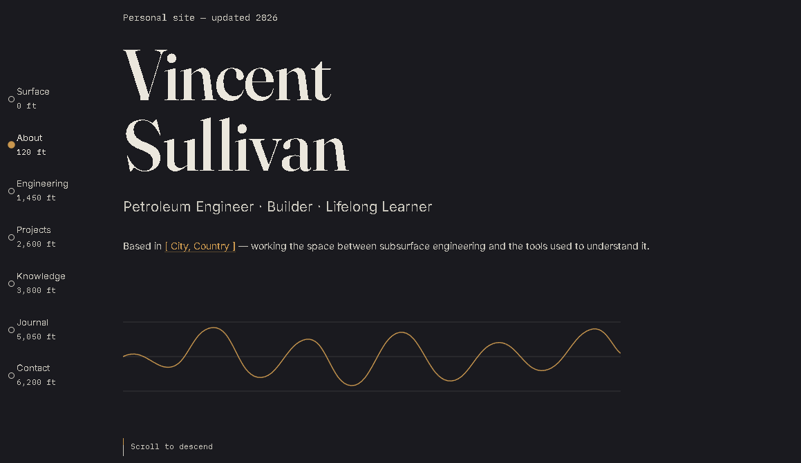

Personal profile built around a subsurface-strata concept; the natural visual language for a petroleum engineer. 

## Table of Contents 
 * [Screenshot](#screenshot) 
 * [Technologies](#technologies) 
 * [Code Reference](#code-reference) 
 * [Contact](#contact) 
 * [License](#license) 

# Screenshot




# Technologies
```
HTML
CSS
Javascript
Google Fonts
```

# Code Reference

- [Guru99](https://www.guru99.com/interactive-javascript-tutorials.html) 
- [W3Schools](https://www.w3schools.com) 
- [moz](https://developer.mozilla.org/en-US/docs/Web/JavaScript/Guide) 
- [learn-js](https://www.learn-js.org/) 
- [HTML Dog](https://htmldog.com/) 
- [JS Cat](http://jsforcats.com/) 
- [JS.com](JavaScript.com) 


# Contact

- [Yahoo](vlsulliv@yahoo.com) 
- [LinkedIn](https://linkedin.com/vlsulliv/) 
- [GitHub](https://github.com/vlsulliv) 

# License
Created under [MIT](https://choosealicense.com/licenses/mit/) license.
[](https://opensource.org/licenses/MIT)

---

Made with ❤️ by Vincent